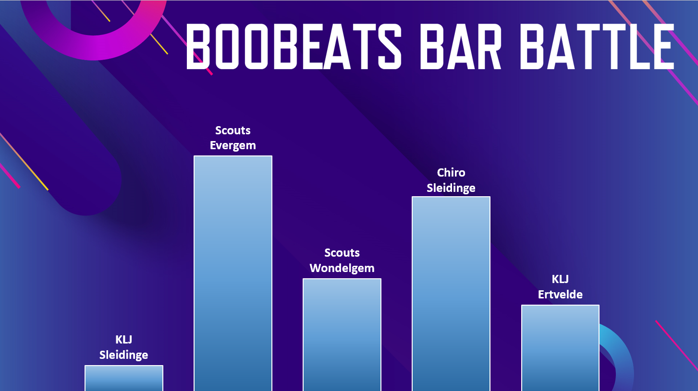

# boobeats-bar-battle

The boobeats bar battle! An interactive leaderboard to represent the amount of drinks that were consumed by the different groups that signed up.
The input-handling is done with 10 buttons and an arduino, the visualisations are done with proccessing.

